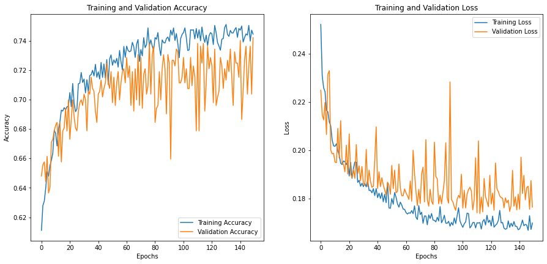

# Deep learning - Wine Quality challenge
# Description

This was a project during training time at BeCode.
We were provided with a wine dataset with contained data on red and white wines. The dataset of this assignment is a combination of a red wine and a white wine dataset. The combined dataset consists of 6497 wines, each with 11 features and a target value.

# Goal
* To use a deep learning library and train the neural network model to identify the good from bad wines.
* Tune the hyperperameters to imporve the performance of the neural network model.

# Installation

## Python version
* Python 3.9

## Packages used
* numpy
* pandas
* scikit-learn
* matplotlib
* seaborn
* tensorflow
* keras
* jupyter notebook

# Usage

File | Description
|:---|:---|
|data/wine.csv|CSV file with wine data|
|base_model.ipynb|Baseline model of neural network using keras|  
|tune_hyperparameter.ipynb|Check the best hyperparameters using GridSearchCV of nearal network model|
|gridsearchcv_model.ipynb|Build the model after tunning the hyperparametes using GridSearchCV|
|different_models_using_base_params.ipynb|use different classification model with baseline model params to check accuracy|
|/Visuals|All visuals|  

# Details of the project

* Distribution of wine quality  

  

* To make category of the target values into two categories (0 and 1)  

| quality value|class of the quality|
|:------|:-------------:|
|below 6|0|
|above or equal to 6|1|  

### Tune the hyperparameters

* Baseline model:  

|hyperparameter|value|
|:---|:---:|
|batch_size|1|
|epochs|30|
|optimizier|Adam|
|network weight(init_mode)|normal|
|neuron activation|relu|
|number of neurons|9|  

* Using GridSearchCV:  

|hyperparameter|value given|best value|
|:---|:---|:---:|
|batch_size|[10, 20, 40, 60, 80, 100]|40|
|epochs|[10, 50, 100,150, 200]|150|
|optimizier|['SGD', 'RMSprop', 'Adagrad', 'Adadelta', 'Adam', 'Adamax', 'Nadam']|Adam|
|network weight(init_mode)|['uniform', 'lecun_uniform', 'normal', 'zero', 'glorot_normal', 'glorot_uniform', 'he_normal', 'he_uniform']|glorot_normal|
|neuron activation|['softmax', 'softplus', 'softsign', 'relu', 'tanh', 'sigmoid', 'hard_sigmoid', 'linear']|relu|
|dropout_rate|[0.0, 0.1, 0.2, 0.3, 0.4, 0.5, 0.6, 0.7, 0.8, 0.9]|0.0|
|number of neurons|[1, 5, 10, 15, 20, 25, 30]|30|  

* Model evaluation:  

|Set|Baseline accuracy|GridSearchCV accuracy|
|:---|:---:|:---:|
|train|0.787|0.751|
|test|0.755|0.747|  

When I used gridsearch on 

* Confusion matrix:  

    

* Validation Accuracy and loss on training:  
- baseline model:    

- after GridSearchCV:  

### Different classification model using kerasclassifier  

|Model name|Accuracy|
|:---|:---:|
|NeuralNet| 0.684|
|KNN|0.760|
|SVC|0.767|
|DecisionTree|0.741|
|RandomForest|0.756|

# Conclusion
I found the lower accuracy after applying GreadSerachCV on the nearal network model becuase I think there was a possibility that i used **loss='binary_crossentropy'**. If I used some other loss then maybe I will got higher accuracy then my **Baseline model.** 

# Contributors
|Name|Github|
|---|:---:|
|Jayesh Italiya|https://github.com/JayeshItaliya86|

# Timeline
07/09/2021-09/09/2021
